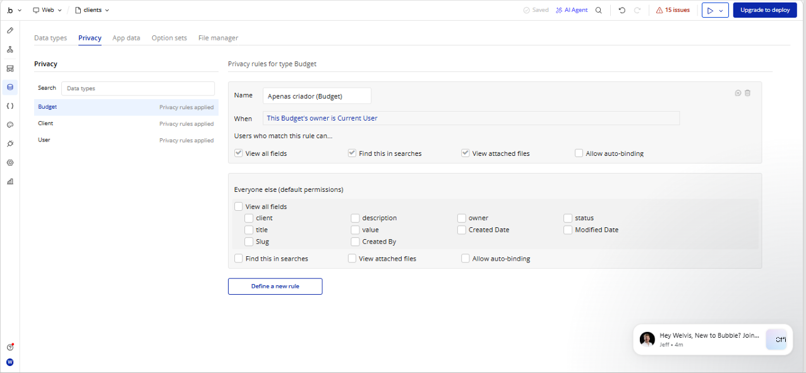
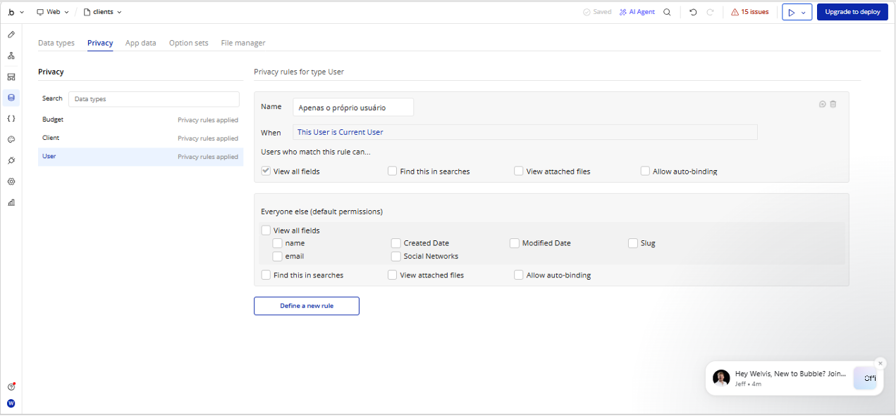
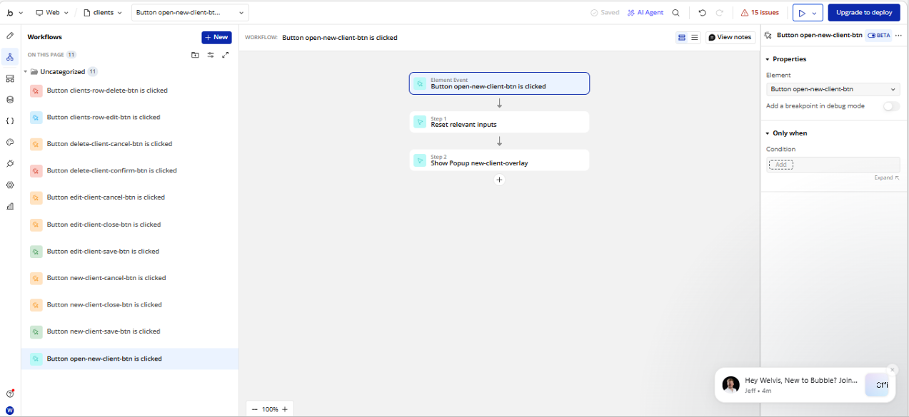

# 🎉 Gestão de Orçamentos com IA no Bubble

## 📝 Descrição do Projeto
Este projeto é um **sistema de gestão de orçamentos**, criado utilizando a plataforma Bubble com o auxílio de Inteligência Artificial para acelerar o desenvolvimento. O sistema permite que usuários se cadastrem, criem orçamentos para clientes e gerenciem o status de aprovação de forma eficiente e segura.

### Funcionalidades:
- **Cadastro de usuários e clientes.**
- **Criação e gerenciamento de orçamentos.**
- **Definição de status dos orçamentos** (Pendente, Aprovado, Rejeitado).
- **Privacidade de dados**: Cada usuário só pode acessar os próprios orçamentos.

---

## 📸 Demonstração Visual

### Figura 1 

### Figura 2 

### Figura 3

### Figura 4

---

## 🚀 Tecnologias Utilizadas
- **Plataforma:** Bubble.io (low-code)
- **IA:** Utilização de IA para acelerar o desenvolvimento do sistema.
- **Banco de Dados:** Configurado diretamente no Bubble para armazenar informações de orçamentos e clientes.
- **Segurança:** Regras de privacidade configuradas para garantir que os dados dos usuários sejam protegidos.

---

## 📊 Resultados e Aprendizados
O sistema foi construído com foco em:

- **Segurança e Privacidade:** Implementação das melhores práticas para garantir que cada usuário visualize apenas os próprios dados.
- **Organização de Workflows:** Estruturação de fluxos automatizados para criação, edição e atualização de orçamentos.
- **Produtividade com IA:** A utilização de Inteligência Artificial acelerou a construção das telas e da lógica inicial do sistema.
- **Experiência do Usuário:** Interface simples e objetiva para facilitar o gerenciamento de clientes e orçamentos.

### Métricas e Objetivos do Projeto
- Redução do tempo de criação de telas utilizando IA.
- Organização automatizada de orçamentos.
- Separação segura dos dados entre usuários.
- Estrutura preparada para futuras expansões do sistema.

---

## 🔧 Como Acessar o Projeto

1. **Acesse o projeto em Bubble:**
   - **[Link para o Projeto no Bubble](https://bubble.io/page?id=welvisunicid-87969&tab=Design&name=index&ai_generated=true&type=page&elements=ai_ROnWudAI)**

2. **Aplicação publicada para testes:**
   - **[Abrir Aplicação](https://welvisunicid-87969.bubbleapps.io/version-test?debug_mode=true)**

No link acima, é possível visualizar a estrutura do sistema, testar os fluxos de criação de orçamentos e analisar as regras de privacidade implementadas.

---

## 🔐 Regras de Privacidade
As regras de privacidade no Bubble foram configuradas para garantir que:

- **Somente o criador do orçamento possa visualizá-lo.**
- **A tabela de orçamentos seja acessível apenas para o usuário responsável pelos dados.**
- **Os dados permaneçam protegidos entre diferentes usuários da aplicação.**

### Exemplo de regra implementada:
- **Tabela "Orçamentos":** Apenas o criador do orçamento possui permissão de visualização e edição dos dados.

---

## 🧠 Análise Técnica
Durante o desenvolvimento, foi possível compreender como plataformas **low-code** podem acelerar projetos utilizando componentes visuais e automações prontas. Porém, também foi necessário realizar ajustes manuais nos workflows e nas permissões para garantir o correto funcionamento do sistema.

O projeto demonstrou na prática:
- A importância da organização lógica dos dados.
- O impacto das regras de privacidade em aplicações web.
- O uso estratégico da Inteligência Artificial como ferramenta de apoio no desenvolvimento.

---

## 💬 Links Importantes
- **Projeto Bubble:** [Acesse o Projeto no Bubble](https://bubble.io/page?id=welvisunicid-87969&tab=Design&name=index&ai_generated=true&type=page&elements=ai_ROnWudAI)
- **Aplicação Publicada:** [Abrir Aplicação](https://welvisunicid-87969.bubbleapps.io/version-test?debug_mode=true)
- **Documentação de Banco de Dados:** [Link para documentação do banco de dados - Planilha, Notion, etc.]

---