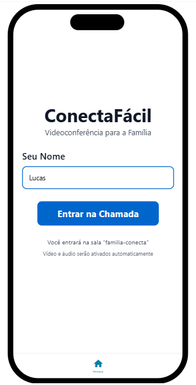
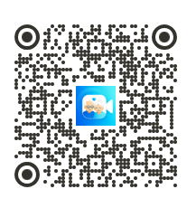

# 📱 ConectaFácil - Videochamada Simplificada para Idosos

## 📝 Descrição do Projeto

O **ConectaFácil** é um aplicativo Android de videoconferência desenvolvido com foco em acessibilidade para idosos. A aplicação utiliza o SDK do Jitsi Meet para permitir que o usuário participe de chamadas de vídeo de maneira simples e rápida, reduzindo dificuldades comuns em aplicativos tradicionais.

O principal objetivo do projeto é promover inclusão digital, oferecendo uma experiência intuitiva para usuários com pouca familiaridade com tecnologia.

---

## 💡 Proposta de Valor

- Interface simplificada e intuitiva  
- Botões grandes e acessíveis  
- Entrada em chamadas com apenas um toque  
- Experiência pensada para idosos  

---

## 🛠 Tecnologias Utilizadas

- Android  
- Jitsi Meet SDK  
- Manus AI  

---

## 📱 Funcionalidades

- Entrada automática em sala de videoconferência  
- Interface minimalista  
- Personalização do nome do usuário  
- Sala fixa: **familia-conecta**  

---

## 📲 Como Usar

1. Abra o aplicativo  
2. Digite seu nome  
3. Clique em **"Entrar na chamada"**  
4. O aplicativo conectará automaticamente à videoconferência  

---

## 🔗 Preview do Aplicativo

👉 https://manus.im/app-preview/3xTmBGWafsjHRpUjc5Ngvn?sessionId=LWAM8kRYRyoZfnbqaCvFOo

---

## 📷 Preview da Interface

**Figura 1 — Interface principal do aplicativo ConectaFácil.**

---

## 📷 QR Code para Instalação

**Figura 2 — QR Code para instalação e teste do aplicativo.**

---

## 🧠 Diferencial do Projeto

O projeto propõe uma solução prática de acessibilidade digital, reduzindo barreiras tecnológicas para idosos e facilitando a comunicação familiar através de videochamadas.

---

## ⚠️ Observações

- Necessário acesso à internet  
- Utiliza sala fixa para simplificar a experiência do usuário  

---

## 🚀 Conclusão

O ConectaFácil demonstra como soluções tecnológicas podem ser adaptadas para públicos específicos, promovendo inclusão digital, acessibilidade e facilidade de uso.